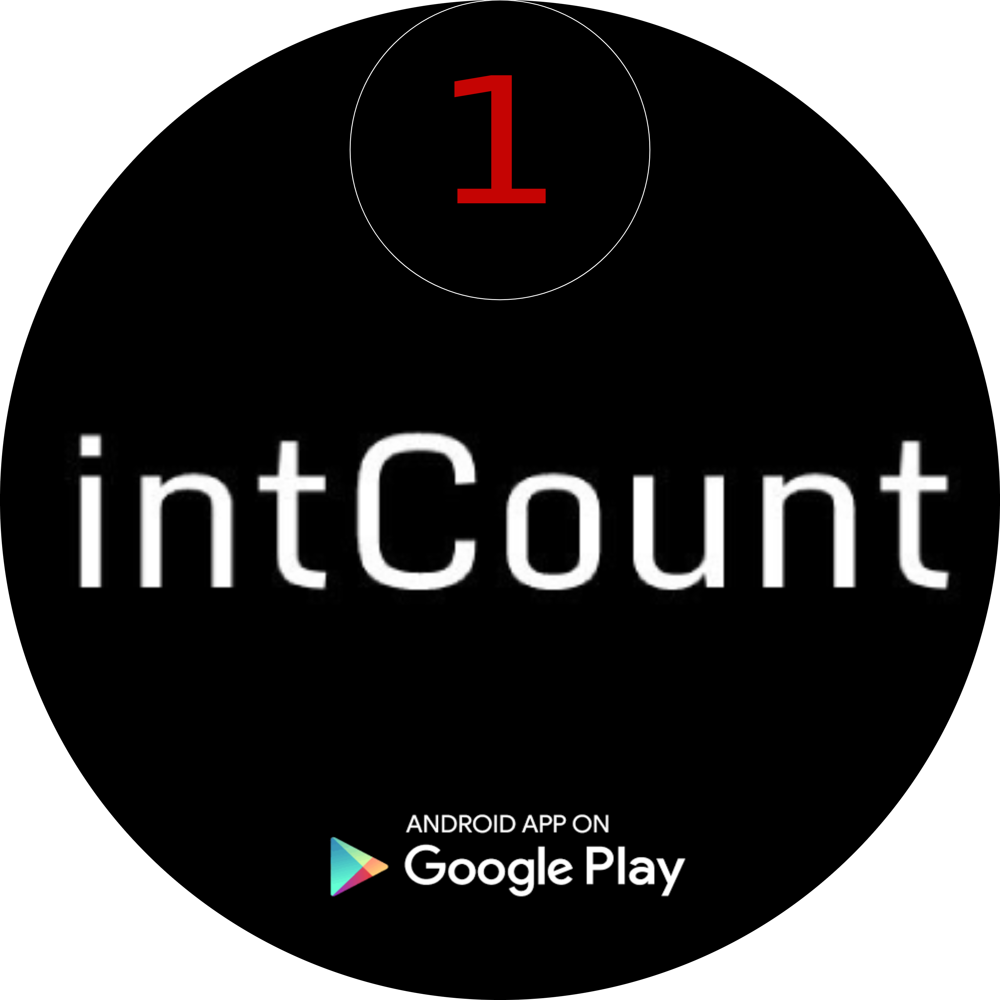

# The Idea of the App

The intCount mobile app is a clever and convenient solution for local businesses, as it enables them to integrate their business information and services into a single platform. Accessible through a unique number on a map, this app simplifies the process of managing finances and promoting the business to potential customers. By consolidating various communication channels, businesses can save time and effort, and potentially improve their profitability.

The app basically allows a business owner and a potential customer to establish a business relationship through a unique number on the map. This number includes the business owner's phone number, WhatsApp number, and social media profiles. The app displays all of this information on a map, making it easy for potential customers to find the business and connect with the owner through various communication channels.

The number on the map also allows businesses to receive notifications of business opportunities and access their invoices and other relevant documents through their unique number on the map. This platform offers a comprehensive solution for managing business finances and promoting businesses to potential customers.

## intCount app on Playstore

**[Link for downloading the app on Playstore](https://play.google.com/store/apps/details?id=com.intCount.ae)**

## Story

The idea behind Hicham creating this app is to develop a simple and straightforward system for opening up opportunities and advertising businesses using a single number or digit that is easy for everyone to remember.

Potential customers can easily search for a business's number on the map and find all the related data they need to conduct business with that store, freelancer, institution, or any other professional entity listed on the app. The app's platform provides a convenient way for potential customers to access all the relevant information about a business in one place, making it easier for them to engage with and potentially transact with the business.

Under its umbrella, the intCount app behaves as a Swiss knife for business owners who use it, since the single number provided by the app can be used to prepare invoices, create quotations, publish public deals for other businesses, or simply advertise their local shop or services. The app's comprehensive platform provides a one-stop-shop for managing all aspects of a business's operations, enabling business owners to save time and effort while increasing their visibility to potential customers.

### bigbooks.io 

The bigbooks.io running service is designed to work in tandem with the intCount mobile application. It handles all documents that are sent and received through the app, including invoices and quotations prepared by businesses that use their unique number on the map. When a business submits a document through the app, it goes directly to bigbooks.io, where the business owner can log in using the same number and password that intCount provided when they were granted a number on the map for the first time. This integrated service streamlines the process of managing business documents and finances, making it easier for business owners to stay on top of their operations.

True to its name, bigbooks.io stores all relevant documents that come from the intCount mobile app. It is a straightforward running service that allows business owners to log in with their unique number on the map and a password, which can be obtained through an annual subscription. By providing a secure and reliable storage solution for business documents, bigbooks.io offers business owners peace of mind and easy access to their financial records whenever they need them.

### How to join to intCount community

Getting a number on the map is a straightforward process. Simply scroll down this page or **intcount.com** website and click on the **sign up** button in the footer section. Then, fill out the form with your business information, which should take no more than five minutes. After submitting the form, you will receive your unique number on the map within one to two days. Congratulations, your business is now visible and accessible to potential customers through intCount's platform!

### How to pay the 30$ annual subscription

For payment, you have two options. First, you can go directly to bigbooks.io and navigate to the payment section, which is located under the password field. There, you will find a section powered by PayPal, where you can make a payment using your PayPal account or a valid credit card.

## Get your intCount badge

When you join the intCount community, we take care of sending you a badge or sticker that can easily and smartly promote your shop or business along the street and in public areas. Anyone who passes by your vehicle or shop can see the name of the app and download it if they're curious to learn more. With the unique number mentioned on your badge, they can easily access all the contact information and data that leads to you or your shop. This is a great way to increase visibility and attract new customers to your business.

## Few features to mention

After getting a number on the map in the intCount mobile app, one of the many features you can benefit from is that your store will be displayed in multiple languages. When you open the app, you can easily see a flag of a country on the top right corner. This option allows you to change the language of the app, including your data. This is a great feature for attracting customers who speak different languages and can make your business more accessible to a wider audience 

Currently, you can display your shop or business data in English, Arabic, German, and Korean languages. This feature allows you to reach a wider audience and makes your business more accessible to customers who speak different languages.